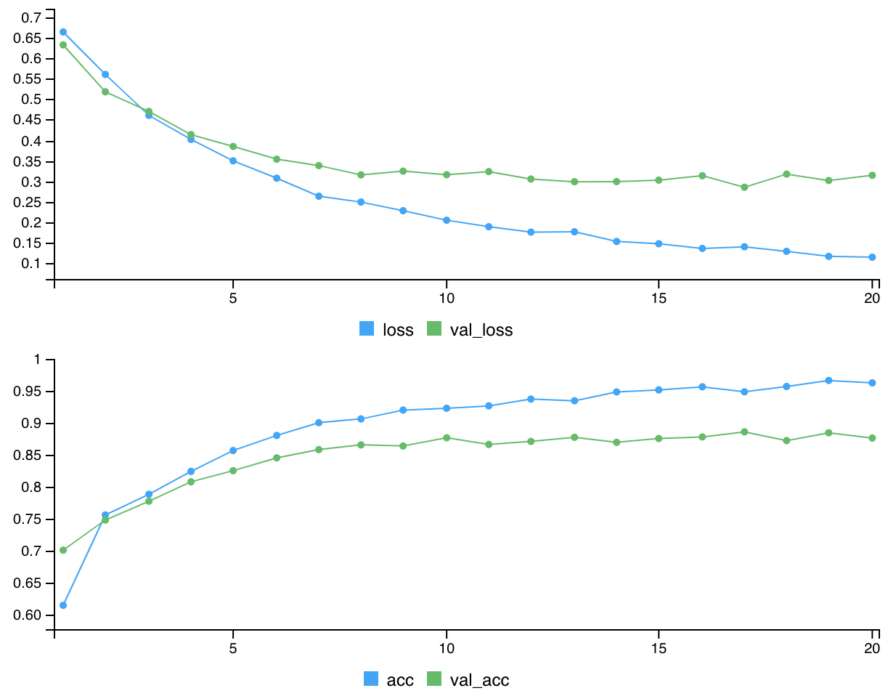
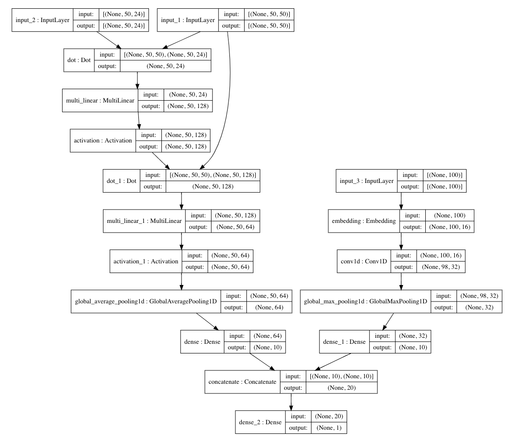
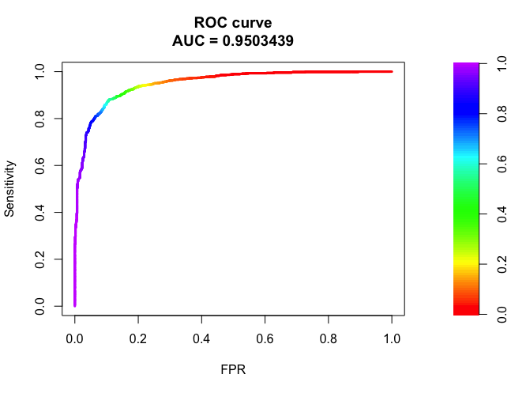
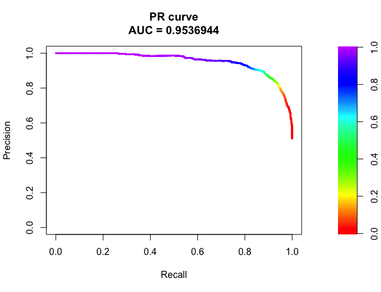

# DeepPINCS

## Introduction

The identification of novel compound-protein interaction (CPI) is important in drug discovery. Revealing unknown compound-protein interactions is useful to design a new drug for a target protein by screening candidate compounds. The accurate CPI prediction assists in effective drug discovery process. To identify potential CPI effectively, prediction methods based on machine learning and deep learning have been developed. Data for sequences are provided as discrete symbolic data. In the data, compounds are represented as SMILES (simplified molecular-input line-entry system) strings and proteins are sequences in which the characters are amino acids. The outcome is defined as a variable that indicates how strong two molecules interact with each other or whether there is an interaction between them. In this package, a deep-learning based model that takes only sequence information of both compounds and proteins as input and the outcome as output is used to predict CPI. The model is implemented by using compound and protein encoders with useful features. The CPI model also supports other modeling tasks, including protein-protein interaction (PPI), chemical-chemical interaction (CCI), or single compounds and proteins. Although the model is designed for proteins, DNA and RNA can be used if they are represented as sequences.


## Installation

Python is required. Furthermore, tensorflow and kears should be installed and they should be connected to R (https://tensorflow.rstudio.com, https://keras.rstudio.com).

To install the stable version from Bioconductor:
```
if (!requireNamespace("BiocManager", quietly = TRUE))
    install.packages("BiocManager")
BiocManager::install("DeepPINCS")
```

To install the development version from GitHub:
``` 
devtools::install_github("dongminjung/DeepPINCS")
```


## Tutorial

The "example_cpi" dataset has compound-protein pairs and their interactions. Each line has a SMILES string, an amino acid sequence, and a label. Here, the label 1 means that the pair of SMILES and amino acid sequences has interaction and 0 means that the pair does not have interaction.

```
library(DeepPINCS)
data.table::data.table(cbind(stringr::str_trunc(example_cpi[1:10, 1:2, drop = FALSE], 30), example_cpi[1:10, 3, drop = FALSE]))

                            smiles                          AAseq label
 1: CC[C@@]1(C[C@@H]2C3=CC(=C(C... MSPLNQSAEGLPQEASNRSLNATETSE...     0
 2:                    C1COCCO1... MSTSSLRRQMKNIVHNYSEAEIKVREA...     1
 3:         CCCC(=O)C1=CN=CC=C1... MAGAGPKRRALAAPAAEEKEEAREKML...     0
 4: CCN[C@H]1CN(S(=O)(=O)C2=C1C... MVVMNSLRVILQASPGKLLWRKFQIPR...     1
 5: C[C@H](C[C@@H](C(=O)O)N)C(=... MKLKLKNVFLAYFLVSIAGLLYALVQL...     0
 6:    CC(C)(CC1=CC=C(C=C1)Cl)N... METTPLNSQKQLSACEDGEDCQENGVL...     1
 7: C[C@H]1[C@@H]([C@H]([C@H]([... MADERKDEAKAPHWTSAPLTEASAHSH...     0
 8:                   C1CC(C1)O... MFLVNSFLKGGGGGGGGGGGLGGGLGN...     0
 9:                  C(C(CO)O)O... MSARGPAIGIDLGTTYSCVGVFQHGKV...     1
10: C1=CC(=C(C(=C1)F)NC(=S)N2C(... MREAAAALVPPPAFAVTPAAAMEEPPP...     1
```

In order to avoid overfitting, the data is split into a training sample and a validation sample. The training sample is used to estimate parameters or weights of deep learning models. The validation sample is an independent sample, set aside to monitor the misclassification error. Here, 70% of the data are used for training and 30% for validation.

```
validation_split <- 0.3
idx <- sample(seq_len(length(example_cpi[,1])))
train_idx <- seq_len(length(example_cpi[,1])) %in%
    idx[seq_len(round(length(example_cpi[,1]) * (1 - validation_split)))]
```

The input sequences are fed into encoders. We need to provide the list of arguments for compound and protein encoder networks and for fully connected layer. For compound and protein networks, input and output tensors of encoders are required. Here, we can choose the graph convolutional network (GCN), recurrent neural network (RNN), convolutional neural network (CNN), and multilayer perceptron (MLP) as encoders. Additionally, we can use our own encoders. Note that the GCN is only available for compounds. The arguments for the "compound" and "protein" are the function of encoders with input and output tensors. The "compound_arg" and "protein_arg" are the arguments of the functions. The compound and protein encoders are concatenated and they are passed to the dense layer. A dense layer is a fully connected layer. We now need to compile the model, this step configures the learning process for our neural network architecture. We need to provide three arguments including the optimization algorithm to be used, the loss function to be optimized and metrics for evaluation.

```
net_args <- list(
    compound = "gcn_in_out",
    compound_args = list(
        gcn_units = c(128, 64),
        gcn_activation = c("relu", "relu"),
        fc_units = c(10),
        fc_activation = c("relu")),
    protein = "cnn_in_out",
    protein_args = list(
        cnn_filters = c(32),
        cnn_kernel_size = c(3),
        cnn_activation = c("relu"),
        fc_units = c(10),
        fc_activation = c("relu")),
    fc_units = c(1),
    fc_activation = c("sigmoid"),
    loss = "binary_crossentropy",
    optimizer = keras::optimizer_adam(),
    metrics = "accuracy")

```

For example, consider the GCN for compounds and the CNN for proteins. For the GCN, we have to set the maximum number of atoms since every compound has not the same number of atoms. The degree of an atom in the graph representation and the atomic symbol and implicit hydrogen count for an atom are used as molecular features. Similarly, we define the maximum number of amino acids because there will be proteins of different lengths. In other words, naturally, some of the proteins are shorter and longer. The layer for embeddings to help us map strings to vectors. For them, we need to provide the dimension of the dense embedding. The n-gram is available only for protein sequences. We can use "callbacks". The callback functions can terminate the training process, modify the learning rate, and save snapshots of the best version of our model during the training process.

```
compound_max_atoms <- 50
protein_embedding_dim <- 16
protein_length_seq <- 100
gcn_cnn_cpi <- fit_cpi(
    smiles = example_cpi[train_idx, 1],
    AAseq = example_cpi[train_idx, 2], 
    outcome = example_cpi[train_idx, 3],
    compound_type = "graph",
    compound_max_atoms = compound_max_atoms,
    protein_length_seq = protein_length_seq,
    protein_embedding_dim = protein_embedding_dim,
    protein_ngram_max = 2,
    protein_ngram_min = 1,
    smiles_val = example_cpi[!train_idx, 1],
    AAseq_val = example_cpi[!train_idx, 2],
    outcome_val = example_cpi[!train_idx, 3],
    net_args = net_args,
    epochs = 20,
    batch_size = 64,
    use_generator = TRUE,
    callbacks = keras::callback_early_stopping(
        monitor = "val_acc",
        patience = 10,
        restore_best_weights = TRUE))

Epoch 1/20
73/74 [============================>.] - ETA: 0s - loss: 0.6654 - acc: 0.6126Epoch 1/20
74/74 [==============================] - 14s 189ms/step - loss: 0.6646 - acc: 0.6142 - val_loss: 0.6331 - val_acc: 0.7008
Epoch 2/20
73/74 [============================>.] - ETA: 0s - loss: 0.5624 - acc: 0.7558Epoch 1/20
74/74 [==============================] - 12s 165ms/step - loss: 0.5609 - acc: 0.7561 - val_loss: 0.5184 - val_acc: 0.7481
Epoch 3/20
73/74 [============================>.] - ETA: 0s - loss: 0.4606 - acc: 0.7890Epoch 1/20
74/74 [==============================] - 12s 165ms/step - loss: 0.4608 - acc: 0.7886 - val_loss: 0.4704 - val_acc: 0.7777
Epoch 4/20
73/74 [============================>.] - ETA: 0s - loss: 0.4030 - acc: 0.8241Epoch 1/20
74/74 [==============================] - 12s 167ms/step - loss: 0.4020 - acc: 0.8245 - val_loss: 0.4136 - val_acc: 0.8081
Epoch 5/20
73/74 [============================>.] - ETA: 0s - loss: 0.3500 - acc: 0.8566Epoch 1/20
74/74 [==============================] - 12s 165ms/step - loss: 0.3497 - acc: 0.8573 - val_loss: 0.3849 - val_acc: 0.8256
Epoch 6/20
73/74 [============================>.] - ETA: 0s - loss: 0.3086 - acc: 0.8801Epoch 1/20
74/74 [==============================] - 12s 168ms/step - loss: 0.3073 - acc: 0.8809 - val_loss: 0.3537 - val_acc: 0.8457
Epoch 7/20
73/74 [============================>.] - ETA: 0s - loss: 0.2629 - acc: 0.9009Epoch 1/20
74/74 [==============================] - 12s 162ms/step - loss: 0.2632 - acc: 0.9010 - val_loss: 0.3381 - val_acc: 0.8587
Epoch 8/20
73/74 [============================>.] - ETA: 0s - loss: 0.2485 - acc: 0.9069Epoch 1/20
74/74 [==============================] - 12s 165ms/step - loss: 0.2489 - acc: 0.9069 - val_loss: 0.3154 - val_acc: 0.8661
Epoch 9/20
73/74 [============================>.] - ETA: 0s - loss: 0.2275 - acc: 0.9214Epoch 1/20
74/74 [==============================] - 13s 169ms/step - loss: 0.2278 - acc: 0.9208 - val_loss: 0.3245 - val_acc: 0.8644
Epoch 10/20
73/74 [============================>.] - ETA: 0s - loss: 0.2044 - acc: 0.9240Epoch 1/20
74/74 [==============================] - 12s 162ms/step - loss: 0.2045 - acc: 0.9236 - val_loss: 0.3158 - val_acc: 0.8773
Epoch 11/20
73/74 [============================>.] - ETA: 0s - loss: 0.1888 - acc: 0.9270Epoch 1/20
74/74 [==============================] - 12s 166ms/step - loss: 0.1886 - acc: 0.9274 - val_loss: 0.3234 - val_acc: 0.8668
Epoch 12/20
73/74 [============================>.] - ETA: 0s - loss: 0.1761 - acc: 0.9377Epoch 1/20
74/74 [==============================] - 12s 163ms/step - loss: 0.1755 - acc: 0.9381 - val_loss: 0.3052 - val_acc: 0.8716
Epoch 13/20
73/74 [============================>.] - ETA: 0s - loss: 0.1771 - acc: 0.9349Epoch 1/20
74/74 [==============================] - 12s 166ms/step - loss: 0.1763 - acc: 0.9354 - val_loss: 0.2986 - val_acc: 0.8780
Epoch 14/20
73/74 [============================>.] - ETA: 0s - loss: 0.1525 - acc: 0.9493Epoch 1/20
74/74 [==============================] - 14s 194ms/step - loss: 0.1526 - acc: 0.9493 - val_loss: 0.2989 - val_acc: 0.8701
Epoch 15/20
73/74 [============================>.] - ETA: 0s - loss: 0.1474 - acc: 0.9525Epoch 1/20
74/74 [==============================] - 15s 199ms/step - loss: 0.1471 - acc: 0.9525 - val_loss: 0.3025 - val_acc: 0.8761
Epoch 16/20
73/74 [============================>.] - ETA: 0s - loss: 0.1354 - acc: 0.9576Epoch 1/20
74/74 [==============================] - 14s 183ms/step - loss: 0.1357 - acc: 0.9573 - val_loss: 0.3133 - val_acc: 0.8786
Epoch 17/20
73/74 [============================>.] - ETA: 0s - loss: 0.1399 - acc: 0.9497Epoch 1/20
74/74 [==============================] - 14s 196ms/step - loss: 0.1397 - acc: 0.9495 - val_loss: 0.2852 - val_acc: 0.8866
Epoch 18/20
73/74 [============================>.] - ETA: 0s - loss: 0.1288 - acc: 0.9576Epoch 1/20
74/74 [==============================] - 14s 186ms/step - loss: 0.1285 - acc: 0.9578 - val_loss: 0.3172 - val_acc: 0.8729
Epoch 19/20
73/74 [============================>.] - ETA: 0s - loss: 0.1163 - acc: 0.9673Epoch 1/20
74/74 [==============================] - 13s 176ms/step - loss: 0.1162 - acc: 0.9673 - val_loss: 0.3016 - val_acc: 0.8851
Epoch 20/20
73/74 [============================>.] - ETA: 0s - loss: 0.1141 - acc: 0.9634Epoch 1/20
74/74 [==============================] - 13s 177ms/step - loss: 0.1142 - acc: 0.9635 - val_loss: 0.3143 - val_acc: 0.8769
```



The plot for model architecture is shown.

```
ttgsea::plot_model(gcn_cnn_cpi$model)
```



Using the trained model, we can predict whether pairs of SMILES and amino acid sequences have interaction or not.

```
pred <- predict_cpi(gcn_cnn_cpi,
    smiles = example_cpi[!train_idx, 1],
    AAseq = example_cpi[!train_idx, 2],
    use_generator = TRUE,
    batch_size = 32)
pred_calss <- ifelse(pred$values > 0.5, 1, 0)
table(pred_calss, example_cpi[!train_idx, 3])
```

A very convenient way to evaluate the accuracy of a model is the use of a table that summarizes the performance of our algorithm against the data provided.

```
pred_calss   0   1
         0 859 112
         1 129 918
```

The Receiver Operator Characteristic (ROC) is a quantitative analysis technique used in binary classification. The ROC curve is a helpful diagnostic for a model. The Area Under the Curve (AUC) can be calculated and provide a single score to summarize the plot that can be used to compare models.

```
roc <- PRROC::roc.curve(scores.class0 = pred$values[example_cpi[!train_idx, 3] == 1],
    scores.class1 = pred$values[example_cpi[!train_idx, 3] == 0],
    curve = TRUE)
plot(roc)
```



An alternative to the ROC curve is the precision-recall curve that can be useful for imbalanced data.

```
pr <- PRROC::pr.curve(scores.class0 = pred$values[example_cpi[!train_idx, 3] == 1],
    scores.class1 = pred$values[example_cpi[!train_idx, 3] == 0],
    curve = TRUE)
plot(pr)
```


